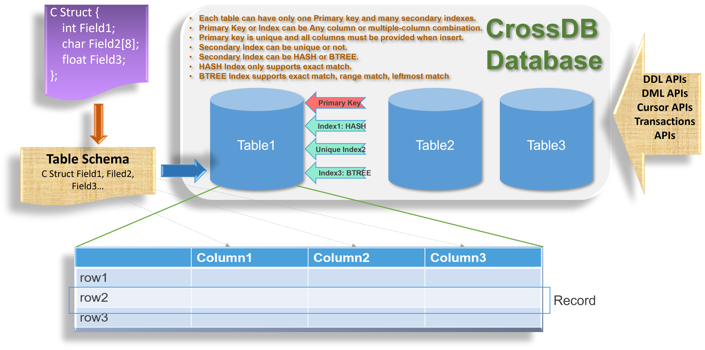

---
hide:
  - navigation
  - toc
---

#

  <div class="cdb-container">
    <div class="cdb-col-md-4">
		<p align="center">
		
		</p>
    </div>
    <div class="cdb-col-md-8">
		<p class="cdb-description"><span class="cdb-accent">CrossDB</span><br>High Performance Embedded Database Development Framework✨</p>
		<p>
			<a class="cdb-button cdb-button-primary" href="/tutorial/getting-started/">Start 🧭</a> 
			<a class=cdb-button href="/tutorial/introduction/">Docs 📜</a>
			<a class=cdb-button href="/tutorial/introduction/">Download 💾</a>
			</p>
    </div>
  </div>

---

  <div class="cdb-container">

    <div class="cdb-card"> 
		<a href="Troubleshooting/Overview">
			<h2>🌌 RDBMS</h2>
			<p>CDB follows standard RDBMS model DB, Tabel, Record, Index, Cursor, Transaction, SQL.</p>
		</a>
    </div>

    <div class="cdb-card"> 
		<a href="Troubleshooting/Overview">
			<h2>🚊 C ORM</h2>
			<p>CDB supports C Struct to access DB direclty. Almost all C data types are supported Enum, Union, Bitfield, Array, nested struct, etc.</p>
		</a>
    </div>

    <div class="cdb-card"> 
		<a href="Troubleshooting/Overview">
			<h2>🚀 Trigger</h2>
			<p>CDB Supports Foreign Key, Trigger and Cascade Trigger. They can be used to do Data-driven programming and unit test.</p>
		</a>
    </div>

    <div class="cdb-card"> 
		<a href="Troubleshooting/Overview">
			<h2>⛽ PubSub</h2>
			<p>CDB supports PubSbub to subscribe DB from other source.</p>
		</a>
    </div>

    <div class="cdb-card"> 
		<a href="Troubleshooting/Overview">
			<h2>💮 RPC</h2>
			<p>CDB supports C struct serailization and a gRPC like RPC framework for C language in future.</p>
		</a>
    </div>

    <div class="cdb-card"> 
		<a href="Troubleshooting/Overview">
			<h2>🔱 Connector</h2>
			<p>CDB supports C/C++ and Python Connectors now, will support more connectors later.</p>
		</a>
    </div>

    <div class="cdb-card"> 
		<a href="Troubleshooting/Overview">
			<h2>♻️ Best Practice</h2>
			<p>Use CDB to Manage Data, do Data-Driven Programming, ISSU, distribut provisioning, etc.</p>
		</a>
    </div>

    <div class="cdb-card"> 
		<a href="Troubleshooting/Overview">
			<h2>🌄 Troubleshooting</h2>
			<p>CDB supports CLI, WEB, Staticstics, Status, Log, DB backup and restore to do troubleshooting.</p>
		</a>
    </div>
	
  </div>

## CrossDB Model



## 5 Minutes to Learn CrossDB

=== "🛶 Schema"
	``` c linenums="1"
	typedef struct {
		uint32_t 			prefix;
		uint8_t 			mask;
		uint32_t			nexthop;
		uint8_t 			metric;
		char				intf[16];
		uint32_t			birth;
		uint32_t			flags;
	} route_t;

	#undef	CROSS_STRUCT_NAME
	#define	CROSS_STRUCT_NAME	route_t
	cross_field_t 	route_schema[] = {
		CROSS_FIELD (prefix,	UINT,	IPv4, 0),
		CROSS_FIELD (mask, 		UINT,	DFT,  0),
		CROSS_FIELD (nexthop,	UINT,	IPv4, 0),
		CROSS_FIELD (metric, 	UINT,	DFT,  0),
		CROSS_FIELD (intf,		CHAR,	DFT,  0),
		CROSS_FIELD (birth, 	UINT,	TS,   0),
		CROSS_FIELD (flags, 	UINT,	HEX,  0),
		CROSS_END (route_t)
	};
	```
=== "⚙️ Create DB"
	``` c linenums="1"
	#define CHECK(ret,str)		if (ret < 0) {	printf (str": %s\n", cross_errMsg(ret)); return -1; }

	// Create database
	ret = cross_dbCreate (&hDb, "mydb", 0);
	CHECK (ret, "Failed to create mydb");

	// Create table: route (PrimaryKey: prefix,mask)
	ret = cross_dbTblCreate (hDb, &hRtTbl, "route", route_schema, "prefix,mask", 0);
	CHECK (ret, "Failed to create route table");

	// Create index on nexthop: idx_nexthop
	ret = cross_dbIdxCreate (hRtTbl, "idx_nexthop", "nexthop", 0);
	CHECK (ret, "Failed to create index idx_nexthop");
	```
=== "⚜️ Insert Rows"
	``` c linenums="1"
	#define IP4ADDR(a,b,c,d)	((a)<<24|(b)<<16|(c)<<8|(d))

	// Insert route 192.168.1.0/24->192.168.1.254
	route.prefix	= IP4ADDR(192,168,1,0);
	route.mask		= 24;	
	route.nexthop	= IP4ADDR(192,168,1,254);
	route.metric	= 1;
	route.flags		= 0;
	strcpy (route.intf, "eth1");
	route.birth		= time (NULL);
	ret = cross_dbInsertRow (hRtTbl, &route, 0); 
	CHECK (ret, "Failed to insert route 192.168.1.0/24");
	```
=== "🚀 Query Rows"
	``` c linenums="1"
	#define IP4STR(ip)				ip>>24,(ip>>16)&0xff,(ip>>8)&0xff,ip&0xff

	// Get single route 192.168.1.0/24 by PrimaryKey
	route.prefix	= IP4ADDR(192,168,1,0);
	route.mask		= 24;	
	ret = cross_dbGetRowByPk (hRtTbl, &route, &route, 0); 
	CHECK (ret, "Failed to get route 192.168.1.0/24 by PrimaryKey");
	printf ("Get single route: %d.%d.%d.%d/%d->%d.%d.%d.%d intf: %s metric: %d flags: 0x%x\n",
			IP4STR(route.prefix), route.mask, IP4STR(route.nexthop), route.intf, route.metric, route.flags);

	// Get one row where nexthop=10.1.2.254
	route.nexthop	= IP4ADDR(10,1,2,254);
	ret = cross_dbGetOneRow (hRtTbl, "nexthop", &route, &route, 0);
	CHECK (ret, "Failed to get one route where nexthop=10.1.2.254");
	printf ("Get one route where nexthop=10.1.2.254: "
			"%d.%d.%d.%d/%d->%d.%d.%d.%d intf: %s metric: %d flags: 0x%x\n",
			IP4STR(route.prefix), route.mask, IP4STR(route.nexthop), route.intf, route.metric, route.flags);
	```
=== "🔫 Update Rows"
	``` c linenums="1"
	// Update single route 192.168.1.0/24 by PrimaryKey: set flags 0->1 metric 1->3
	route.prefix	= IP4ADDR(192,168,1,0);
	route.mask		= 24;	
	route.metric	= 3;
	route.flags		= 1;
	ret = cross_dbUpdRowByPk (hRtTbl, &route, "flags,metric", &route, 0); 
	CHECK (ret, "Failed to update route 192.168.1.0/24 by PrimaryKey");

	// Update routes where nexthop=10.1.2.254: set flags 0->3
	route.nexthop	= IP4ADDR(10,1,2,254);
	route.flags		= 3;
	count = cross_dbUpdateRows (hRtTbl, "nexthop", &route, "flags", &route, 0);
	CHECK (count, "Failed to update routes where nexthop=10.1.2.254");
	```
=== "🎡 Cursor Query"
	``` c linenums="1"
	// Use cursor to get routes where nexthop=10.1.2.254
	cross_cursor_h hCursor;
	route.nexthop	= IP4ADDR(10,1,2,254);
	count = cross_dbQueryRows (hRtTbl, &hCursor, "nexthop", &route, 0);
	printf ("Query %d routes where nexthop=10.1.2.254\n", count);
	while (CROSS_OK == cross_cursorGetNextRow (hCursor, &route, 0)) {
		printf ("route: %d.%d.%d.%d/%d->%d.%d.%d.%d intf: %s metric: %d flags: 0x%x\n",
				IP4STR(route.prefix), route.mask, IP4STR(route.nexthop), route.intf, route.metric, route.flags);
	}
	cross_cursorClose (hCursor, 0);
	```
=== "✂️ Delete Rows"
	``` c linenums="1"
	// Delete single route 192.168.1.0/24 by PrimaryKey
	route.prefix	= IP4ADDR(192,168,1,0);
	route.mask		= 24;	
	ret = cross_dbDelRowByPk (hRtTbl, &route, 0); 
	CHECK (ret, "Failed to delete route 192.168.1.0/24 by PrimaryKey");

	// Delete routes where nexthop=10.1.2.254
	route.nexthop	= IP4ADDR(10,1,2,254);
	count = cross_dbDeleteRows (hRtTbl, "nexthop", &route, 0);
	printf ("Update %d rows where nexthop=10.1.2.254\n", count);
	```

=== "🌄 Transaction"
	``` c linenums="1"
	ret = cross_dbTransBegin (hDb, 0);
	CHECK (ret, "Failed to begin transaction");
	// Update single route 192.168.1.0/24 by PrimaryKey: set flags 0->5
	route.prefix	= IP4ADDR(192,168,1,0);
	route.mask		= 24;	
	route.flags		= 5;
	ret = cross_dbUpdRowByPk (hRtTbl, &route, "flags", &route, 0); 
	CHECK (ret, "Failed to update route 192.168.1.0/24 by PrimaryKey");
	ret = cross_dbTransCommit (hDb, 0);
	CHECK (ret, "Failed to commit transaction");
	```

## [Want to Lean More?](docs/)
